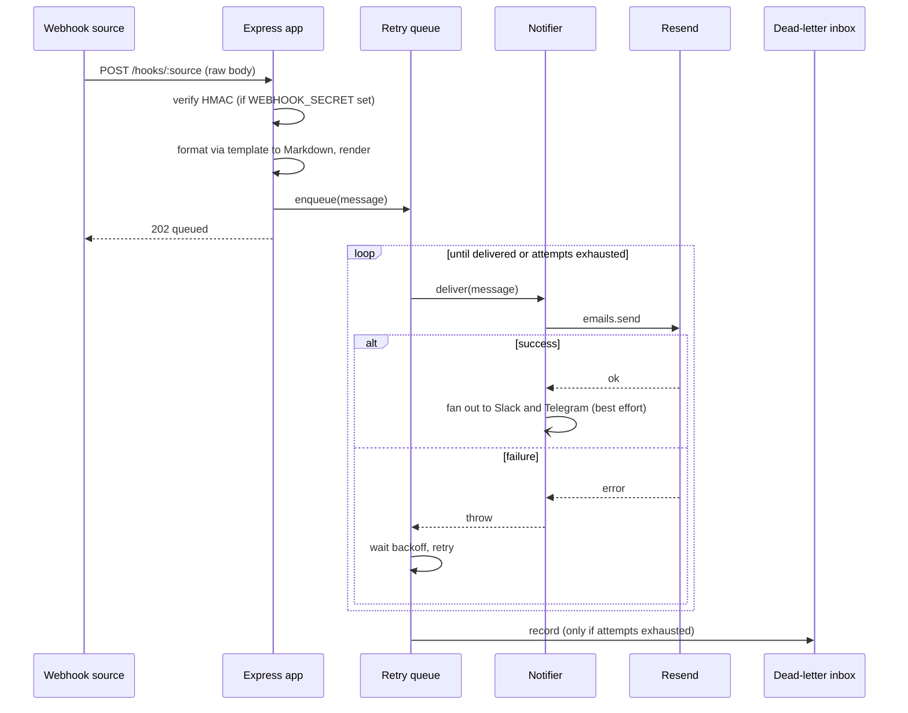

# Architecture

The service is a single Express app split into focused, individually testable modules. There is no database. The only durable state is the dead-letter JSON Lines file. Everything else lives in memory for the lifetime of the process, which keeps the deployment story to one container.

## Module map

| Module | Responsibility |
|---|---|
| `src/index.js` | Entrypoint. Reads env, wires the real Resend client into the notifier, builds the queue and dead-letter inbox, starts the server, handles graceful shutdown |
| `src/app.js` | Express app factory. Injectable dependencies, route handlers, template dispatch and the default formatter |
| `src/verify.js` | Per-provider HMAC verification (generic, GitHub, Cal.com, Linear, Stripe with timestamp tolerance) |
| `src/render.js` | Dependency-free Markdown to HTML and plain-text rendering, and template result normalisation |
| `src/queue.js` | In-memory retry queue with exponential backoff and full jitter |
| `src/deadletter.js` | Dead-letter inbox: JSONL persistence plus a bounded in-memory ring |
| `src/notify.js` | Delivery channels: email (Resend), Slack Block Kit, Telegram |
| `src/templates/<source>.js` | Per-source formatters returning Markdown |

## Request lifecycle

## Design decisions

**Decoupled delivery.** The handler enqueues and returns `202` rather than sending inline. This keeps response latency flat regardless of how Resend is behaving and lets retries happen without holding the source's connection open. The trade-off is that a `202` means "accepted and queued", not "delivered", so durability is provided by the dead-letter inbox rather than by a synchronous response.

**In-memory queue, file-based dead letter.** A real broker would add durability for in-flight jobs but also an external dependency and a heavier deployment. The chosen middle ground keeps the queue in memory for transient-outage resilience and persists only the failures that need recovering. On a clean shutdown the queue flushes any undelivered jobs to the dead-letter file so they are not lost.

**Exponential backoff with full jitter.** Backoff doubles each attempt up to a cap, and full jitter spreads retries randomly within the window so a provider recovering from an outage is not hit by a synchronised retry storm.

**Per-provider verification.** Webhook signing schemes differ. GitHub, Cal.com and Linear are hex HMACs in different headers; Stripe signs `<timestamp>.<body>` and expects a timestamp check. The verifier encodes each provider's scheme behind one function and validates in constant time, with Stripe additionally rejecting stale timestamps.

**Markdown templates.** Templates return Markdown rather than hand-written HTML so a new source is quick to add and consistently styled. The renderer is a small in-repo subset of Markdown, which avoids a dependency and removes any chance of third-party HTML injection. All payload values are escaped before rendering.

**Best-effort fan-out.** Email is the source of truth. Slack and Telegram failures are logged but never fail the job, because retrying the email to recover a chat notification would spam the inbox.

**Injectable everything.** The email sender, the fan-out fetch, the queue timer and the template directory are all injected. The end-to-end tests run the real app on an ephemeral port and only fake the outermost network edges.

## Resource usage

Single-process Node. Roughly 50MB RSS at idle. The queue and dead-letter ring are bounded, so memory stays flat under sustained load. The practical bottleneck is the Resend send rate, not the service.
