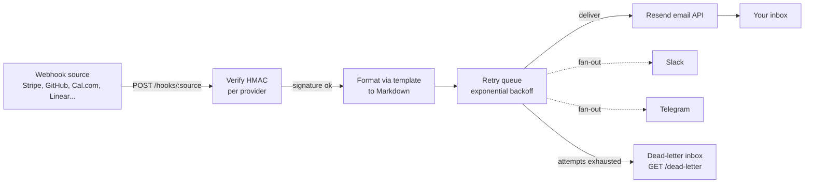

# Webhook to Email

POST any webhook, get a clean formatted email, with durable retries and optional Slack and Telegram fan-out.

[](https://github.com/sarmakska/webhook-to-email/blob/main/LICENSE)
[](https://github.com/sarmakska/webhook-to-email)
[](https://github.com/sarmakska/webhook-to-email/commits/main)

A small, self-hosted Node.js service that turns webhook traffic from Stripe, GitHub, Cal.com, Linear or anything else into readable, Markdown-rendered emails. It verifies each request with per-provider HMAC signatures, formats the payload with a per-source template, and delivers through Resend behind a retry queue with exponential backoff. Anything that cannot be delivered after every retry lands in a durable dead-letter inbox you can browse over HTTP, so a webhook is never silently lost.

## What is in the box

- **Single endpoint.** `POST /hooks/:source` accepts any JSON body. `GET /` reports queue depth and dead-letter count, `GET /health` is for liveness, and `GET /dead-letter` lists recent delivery failures.
- **Per-provider HMAC verification.** Set `WEBHOOK_SECRET` and every request must carry a valid signature. The verifier knows the signing scheme for GitHub, Cal.com, Linear and Stripe, including Stripe's timestamped header with replay protection, and falls back to a generic `sha256=<hex>` scheme for everything else.
- **Retry queue with exponential backoff.** Delivery is decoupled from the request. The endpoint returns `202` immediately and a background worker delivers with configurable attempts and exponential backoff with jitter.
- **Dead-letter inbox.** A job that exhausts every retry is written to a JSON Lines file and kept in a bounded in-memory ring, browsable at `GET /dead-letter`. Undelivered jobs are flushed to the inbox on shutdown.
- **Rich Markdown email rendering.** Templates return Markdown and the built-in renderer produces a styled, inline-CSS HTML body plus a clean plain-text fallback. No Markdown dependency, and all payload values are HTML-escaped.
- **Slack and Telegram fan-out.** Set `SLACK_WEBHOOK_URL` for Slack Block Kit messages and `TELEGRAM_BOT_TOKEN` plus `TELEGRAM_CHAT_ID` for Telegram. Both are best-effort and never block or fail email delivery.
- **Bundled templates.** Stripe, GitHub, Cal.com and Linear formatters are ready to use and double as worked examples.
- **Container-ready.** Multi-stage Alpine Dockerfile and a docker-compose file with a health check and a persistent volume for the dead-letter inbox.

## Quickstart

```bash
git clone https://github.com/sarmakska/webhook-to-email.git
cd webhook-to-email
npm install
cp .env.example .env   # fill in RESEND_API_KEY and NOTIFY_EMAIL
npm start
```

Then send a test webhook from another terminal:

```bash
curl -X POST http://localhost:3000/hooks/test \
  -H "Content-Type: application/json" \
  -d '{"hello":"world","user":{"name":"Sarma"}}'
```

You get a `202 {"ok":true,"queued":true}` straight away, the worker delivers the email, and an email titled "Webhook: test" lands in your inbox.

## Architecture



A request comes in, the signature is checked when a secret is configured, the payload is run through a matching template into Markdown, and the rendered message is enqueued. The endpoint returns `202` immediately. A background worker delivers via Resend with exponential-backoff retries, fans out to Slack and Telegram on success, and writes any permanently failed job to the dead-letter inbox. State lives in a single in-memory queue plus the dead-letter file, which keeps the service to one container with no external database.

## Configuration

| Env var | Required | Default | Purpose |
|---|---|---|---|
| `RESEND_API_KEY` | yes | none | API key from resend.com |
| `NOTIFY_EMAIL` | yes | none | Recipient. Comma-separate for several |
| `FROM_EMAIL` | no | `webhooks@onresend.dev` | Use a verified domain in production |
| `WEBHOOK_SECRET` | no | none | If set, requests must carry a valid HMAC signature |
| `SLACK_WEBHOOK_URL` | no | none | If set, events fan out to Slack |
| `TELEGRAM_BOT_TOKEN` | no | none | Telegram bot token (needs `TELEGRAM_CHAT_ID` too) |
| `TELEGRAM_CHAT_ID` | no | none | Telegram chat to post to |
| `DEAD_LETTER_FILE` | no | `./data/dead-letter.jsonl` | Path for the dead-letter JSONL file |
| `RETRY_MAX_ATTEMPTS` | no | `5` | Delivery attempts before dead-lettering |
| `RETRY_BASE_DELAY_MS` | no | `500` | Base backoff delay |
| `RETRY_MAX_DELAY_MS` | no | `30000` | Backoff cap |
| `PORT` | no | `3000` | Server port |

## Adding a source template

Drop a JavaScript file in `src/templates/`. It receives the parsed payload and returns `{ subject, markdown }`, or `null` to fall through to the default JSON formatter. The renderer derives the HTML and plain-text bodies from your Markdown.

```js
// src/templates/stripe.js
module.exports = function format(payload) {
  if (payload.type === 'invoice.paid') {
    const inv = payload.data.object
    const amount = (inv.amount_paid / 100).toFixed(2)
    return {
      subject: `Invoice paid: ${amount} GBP`,
      markdown: [
        '# Invoice paid',
        '',
        `**Amount:** ${amount} GBP`,
        `**Customer:** ${inv.customer_email}`,
      ].join('\n'),
    }
  }
  return null
}
```

POST to `/hooks/stripe` and the template fires. See `examples/` and the bundled Stripe, GitHub, Cal.com and Linear templates for more.

## When to use this

- You want a single notification destination for webhooks from several SaaS tools instead of one inbox rule per service.
- You want a readable, formatted email per event rather than raw JSON in a logging tool, plus optional Slack and Telegram copies.
- You want durable delivery on a single container: retries with backoff and a dead-letter inbox, without standing up Redis or a database.
- You want something small, auditable and self-hosted that you can extend with a few lines of JavaScript.

## When not to use this

- You need delivery guarantees across process restarts and crashes for in-flight jobs. The retry queue is in-memory; undelivered jobs are flushed to the dead-letter file on a clean shutdown, but a hard crash can drop a job that is mid-retry. Put a real broker in front if that matters.
- You need to fan a single source out to many recipients with per-event routing rules. Comma-separated recipients are supported, but rule-based routing is not.
- You need very high throughput. A single Node process is fine for typical webhook volumes; beyond that, run several behind a queue.

## Deploy

```bash
# Docker
docker build -t webhook-to-email .
docker run -d --env-file .env -p 3000:3000 -v webhook-data:/app/data webhook-to-email

# docker-compose
docker compose up -d
```

It also runs unchanged on Fly.io, Render and Railway. Set the env vars and point your webhooks at `/hooks/<source>`. Mount a volume at `/app/data` to persist the dead-letter inbox.

## Documentation

Full docs, deeper architecture, per-source template guides, an HMAC reference, retry and dead-letter internals, fan-out setup, a production checklist and troubleshooting live in the [project wiki](https://github.com/sarmakska/webhook-to-email/wiki).

## Licence

MIT. Built by [Sarma](https://sarmalinux.com).

---

## More open source by Sarma

Part of a portfolio of production-shaped open-source repositories built and maintained by [Sarma](https://sarmalinux.com).

| Repository | What it is |
|---|---|
| [Sarmalink-ai](https://github.com/sarmakska/Sarmalink-ai) | Multi-provider OpenAI-compatible AI gateway with 14-engine failover and intent-based plugin auto-routing |
| [agent-orchestrator](https://github.com/sarmakska/agent-orchestrator) | Durable multi-agent workflows in TypeScript with deterministic replay and Inspector UI |
| [voice-agent-starter](https://github.com/sarmakska/voice-agent-starter) | Sub-second full-duplex voice agent loop. WebRTC, mediasoup, pluggable STT / LLM / TTS |
| [ai-eval-runner](https://github.com/sarmakska/ai-eval-runner) | Evals as code. Python, DuckDB, FastAPI viewer, regression mode for CI |
| [mcp-server-toolkit](https://github.com/sarmakska/mcp-server-toolkit) | Production Model Context Protocol server starter (Python / FastAPI) |
| [local-llm-router](https://github.com/sarmakska/local-llm-router) | OpenAI-compatible proxy that routes to Ollama or cloud providers based on policy |
| [rag-over-pdf](https://github.com/sarmakska/rag-over-pdf) | Minimal end-to-end RAG starter for PDF corpora |
| [receipt-scanner](https://github.com/sarmakska/receipt-scanner) | Vision OCR for receipts with Zod-validated JSON output |
| [webhook-to-email](https://github.com/sarmakska/webhook-to-email) | Webhook receiver that forwards events to email via Resend |
| [k8s-ops-toolkit](https://github.com/sarmakska/k8s-ops-toolkit) | Helm chart for shipping Next.js to Kubernetes with full observability stack |
| [terraform-stack](https://github.com/sarmakska/terraform-stack) | Vercel + Supabase + Cloudflare + DigitalOcean modules in one Terraform repo |
| [staff-portal](https://github.com/sarmakska/staff-portal) | Open-source HR / ops portal: leave, attendance, expenses, kiosk mode |

Engineering essays at [sarmalinux.com/blog](https://sarmalinux.com/blog). All projects at [sarmalinux.com/open-source](https://sarmalinux.com/open-source)
