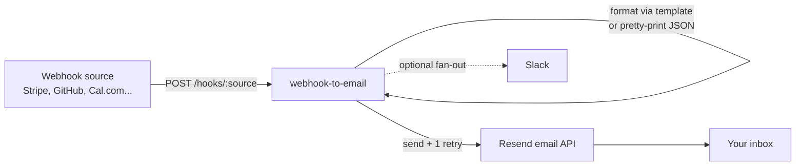

# Webhook to Email

POST any webhook, get a clean formatted email. One small self-hosted service, no database.

[](https://github.com/sarmakska/webhook-to-email/blob/main/LICENSE)
[](https://github.com/sarmakska/webhook-to-email)
[](https://github.com/sarmakska/webhook-to-email/commits/main)

A roughly 200-line Node.js service that turns webhook traffic into readable emails, with optional Slack fan-out. It verifies the request signature (HMAC-SHA256, optional but recommended), formats the payload using a per-source template if one exists, and sends the result through Resend. It is stateless, logs to stdout, and runs anywhere that can run a container.

## Quickstart

```bash
git clone https://github.com/sarmakska/webhook-to-email.git
cd webhook-to-email
npm install
cp .env.example .env   # fill in RESEND_API_KEY and NOTIFY_EMAIL
npm start
```

Then send a test webhook from another terminal:

```bash
curl -X POST http://localhost:3000/hooks/test \
  -H "Content-Type: application/json" \
  -d '{"hello":"world","user":{"name":"Sarma"}}'
```

Check your inbox. You should have an email titled "Webhook . test".

## What is in the box

- **Single endpoint.** `POST /hooks/:source` accepts any JSON body. `GET /` and `GET /health` for liveness.
- **HMAC verification.** Set `WEBHOOK_SECRET` and every request must carry a valid signature. Reads `X-Signature`, `X-Hub-Signature-256`, or `X-Stripe-Signature`, with or without the `sha256=` prefix, and compares in constant time.
- **Per-source templates.** Drop `src/templates/<source>.js` and it formats that source. No template means the payload is pretty-printed as JSON, so a new source works with zero config.
- **Bundled templates.** Stripe, GitHub, and Cal.com formatters are ready to use and double as worked examples.
- **Slack fan-out.** Set `SLACK_WEBHOOK_URL` and each event is also posted to Slack.
- **Resilient send.** One automatic retry if Resend returns an error.
- **Container-ready.** Multi-stage Dockerfile (Alpine, roughly 80MB) and a docker-compose file with a health check.

## Architecture



The flow is linear and stateless. A request comes in, the signature is checked when a secret is configured, the payload is run through a matching template (falling back to a JSON pretty-printer), the email is sent via Resend with a single retry, and Slack is notified if configured. There is no queue and no persistence, which keeps the service trivial to deploy and reason about.

## Configuration

| Env var | Required | Default | Purpose |
|---|---|---|---|
| `RESEND_API_KEY` | yes | none | API key from resend.com |
| `NOTIFY_EMAIL` | yes | none | Where the emails are delivered |
| `FROM_EMAIL` | no | `webhooks@onresend.dev` | Use a verified domain in production |
| `WEBHOOK_SECRET` | no | none | If set, requests must carry a valid HMAC-SHA256 signature |
| `SLACK_WEBHOOK_URL` | no | none | If set, events are also forwarded to Slack |
| `PORT` | no | `3000` | Server port |

## Adding a source template

Drop a JavaScript file in `src/templates/`. It receives the parsed payload and returns `{ subject, text, html }`, or `null` to fall through to the default JSON formatter.

```js
// src/templates/stripe.js
module.exports = function format(payload) {
  if (payload.type === 'invoice.paid') {
    const amount = (payload.data.object.amount_paid / 100).toFixed(2)
    return {
      subject: `Invoice paid . GBP ${amount}`,
      text: `Customer: ${payload.data.object.customer_email}`,
      html: `<p>Customer: ${payload.data.object.customer_email}</p>`,
    }
  }
  return null
}
```

POST to `/hooks/stripe` and the template fires. See `examples/` and the bundled Stripe, GitHub, and Cal.com templates for more.

## When to use this

- You want a single notification destination for webhooks from several SaaS tools instead of one inbox rule per service.
- You want a readable email per event rather than raw JSON in a logging tool.
- You want something small, auditable, and self-hosted that you can extend with a few lines of JavaScript.

## When not to use this

- You need guaranteed delivery. This is stateless with no retry queue and no dead-letter store. If Resend is unavailable, the message is lost. Put a queue in front if that matters.
- You need to fan a single source out to many different recipients with routing rules. That is on the roadmap, not in the box today.
- You need rate limiting or a body-size policy beyond the defaults. Run it behind your platform WAF or extend `src/index.js`.

## Deploy

```bash
# Docker
docker build -t webhook-to-email .
docker run -d --env-file .env -p 3000:3000 webhook-to-email

# docker-compose
docker compose up -d
```

It also runs unchanged on Fly.io, Render, and Railway. Set the env vars and point your webhooks at `/hooks/<source>`.

## Documentation

Full docs, deeper architecture, per-source template guides, an HMAC reference, a production checklist, and troubleshooting live in the [project wiki](https://github.com/sarmakska/webhook-to-email/wiki).

## Licence

MIT. Built by [Sarma](https://sarmalinux.com).

---

## More open source by Sarma

Part of a portfolio of production-shaped open-source repositories built and maintained by [Sarma](https://sarmalinux.com).

| Repository | What it is |
|---|---|
| [Sarmalink-ai](https://github.com/sarmakska/Sarmalink-ai) | Multi-provider OpenAI-compatible AI gateway with 14-engine failover and intent-based plugin auto-routing |
| [agent-orchestrator](https://github.com/sarmakska/agent-orchestrator) | Durable multi-agent workflows in TypeScript with deterministic replay and Inspector UI |
| [voice-agent-starter](https://github.com/sarmakska/voice-agent-starter) | Sub-second full-duplex voice agent loop. WebRTC, mediasoup, pluggable STT / LLM / TTS |
| [ai-eval-runner](https://github.com/sarmakska/ai-eval-runner) | Evals as code. Python, DuckDB, FastAPI viewer, regression mode for CI |
| [mcp-server-toolkit](https://github.com/sarmakska/mcp-server-toolkit) | Production Model Context Protocol server starter (Python / FastAPI) |
| [local-llm-router](https://github.com/sarmakska/local-llm-router) | OpenAI-compatible proxy that routes to Ollama or cloud providers based on policy |
| [rag-over-pdf](https://github.com/sarmakska/rag-over-pdf) | Minimal end-to-end RAG starter for PDF corpora |
| [receipt-scanner](https://github.com/sarmakska/receipt-scanner) | Vision OCR for receipts with Zod-validated JSON output |
| [webhook-to-email](https://github.com/sarmakska/webhook-to-email) | Webhook receiver that forwards events to email via Resend |
| [k8s-ops-toolkit](https://github.com/sarmakska/k8s-ops-toolkit) | Helm chart for shipping Next.js to Kubernetes with full observability stack |
| [terraform-stack](https://github.com/sarmakska/terraform-stack) | Vercel + Supabase + Cloudflare + DigitalOcean modules in one Terraform repo |
| [staff-portal](https://github.com/sarmakska/staff-portal) | Open-source HR / ops portal: leave, attendance, expenses, kiosk mode |

Engineering essays at [sarmalinux.com/blog](https://sarmalinux.com/blog). All projects at [sarmalinux.com/open-source](https://sarmalinux.com/open-source)
